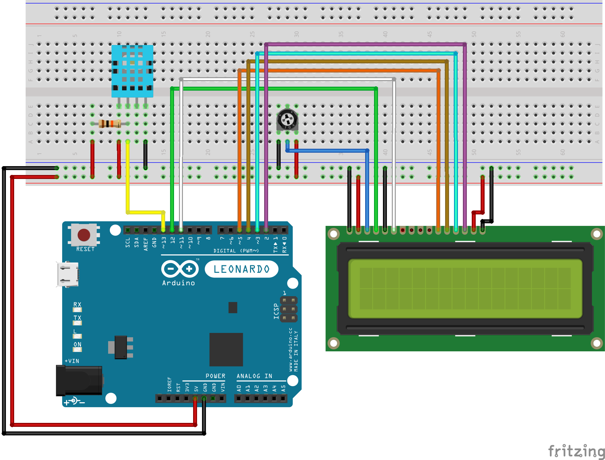

# 🌡️ DHT11 Temperature & Humidity LCD Display

This Arduino project reads **temperature** and **humidity** data from a DHT11 sensor and displays the results in real time on a 16×2 LCD screen. It's a simple yet practical weather monitoring system.

---

## 🔧 Components Used

| Component              | Quantity |
|------------------------|----------|
| Arduino Uno / Leonardo | 1        |
| Breadboard             | 1        |
| DHT11 Sensor           | 1        |
| 16x2 LCD Display       | 1        |
| 10kΩ Potentiometer     | 1        |
| 10kΩ Resistor          | 1        |
| Jumper Wires           | ~20      |

---

## 📷 Circuit Diagram

---

## 🧠 How It Works

- The DHT11 sensor measures **temperature** and **humidity**.
- The values are displayed on the **LCD** in two lines:
  - Line 1: `Temp: 24.3°C`
  - Line 2: `Humidity: 58.7%`
- Data is updated every **2 seconds**.
- If the sensor fails, an error message is shown on the LCD.

---

## 💡 Highlights

- ✅ Real-time sensor reading using the `DHT` library  
- ✅ LCD interfacing using the `LiquidCrystal` library  
- ✅ Error handling for sensor issues  
- ✅ Clean serial monitoring via `Serial.println()`

---

## 🧪 Planned Improvements

- Use DHT22 for better accuracy  
- Display °C/°F toggle via a button  
- Add icons or visual bars on the LCD

---

> Made with 💧 + ☀️ using [Fritzing](https://fritzing.org/) and Arduino IDE.
