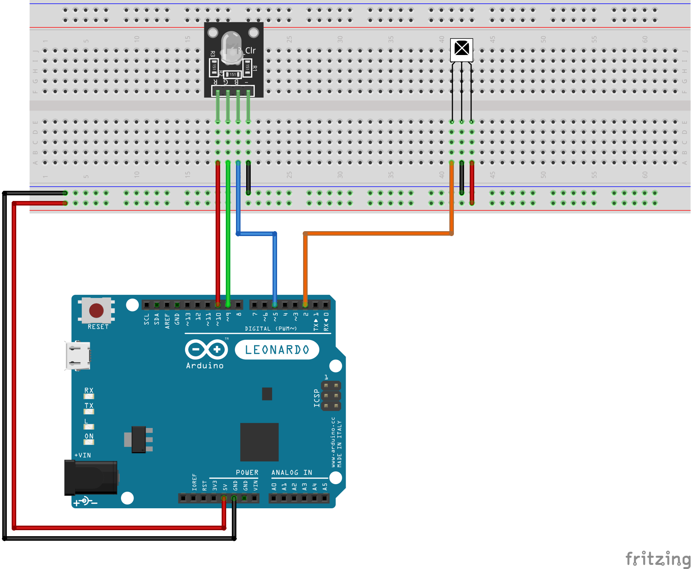

# 🎮 IR Remote RGB Controller with Animations

This Arduino project uses an **infrared remote control** to manage an RGB LED.  
Each remote button triggers **unique animations, color transitions**, or effects — from smooth fades to quick flashes.  
It's a great introduction to IR signal decoding, PWM color blending, and embedded animations.

---

## 🔧 Components Used

| Component              | Quantity |
|------------------------|----------|
| Arduino Uno / Leonardo | 1        |
| Breadboard             | 1        |
| IR Receiver (VS1838B)  | 1        |
| RGB LED Module         | 1        |
| Jumper Wires           | 9        |

---

## 📷 Circuit Diagram

---

## 🧠 How It Works

- The **IR receiver** decodes signals from the remote using the `IRremote` library.
- Each button is mapped to a specific action:
  - 🔴 CH- → Fade-in red
  - 🟢 CH  → Fade-in green
  - 🔵 CH+ → Fade-in blue
  - ⏮  <<  → Pulsating white
  - ⏭  >>  → Rapid color strobe
  - ⏸  >|| → Smooth red-to-blue transition
  - ➖  –   → Gradual dimming
  - ➕  +   → Brightness ramp-up
  - 💥 EQ  → White light burst
  - 🌈 100+  → Color switching (red, orange, yellow, green, blue)
  - 🌠 200+ → Smooth color transitions with fading (gradual color change from red to blue)
  - 🔢 Digits → Static colors (0 = off, 1 = red, ..., 9 = white)

---

## 💡 Highlights

- ✅ Full remote control using `IRrecv`
- ✅ 10+ unique LED animation modes
- ✅ Clean modular code (e.g., `animatePause()`, `animateColor100Plus()`)
- ✅ Uses `analogWrite()` for smooth RGB blending
- ✅ Built-in handling of noise/empty IR codes

---

## 🧪 Planned Improvements

- Add custom mode to mix colors with long-press
- Implement debounce delay between signals
- Add mode to rotate animations automatically

---

> Made with 🔴🟢🔵 using [Fritzing](https://fritzing.org/) and Arduino IDE.
