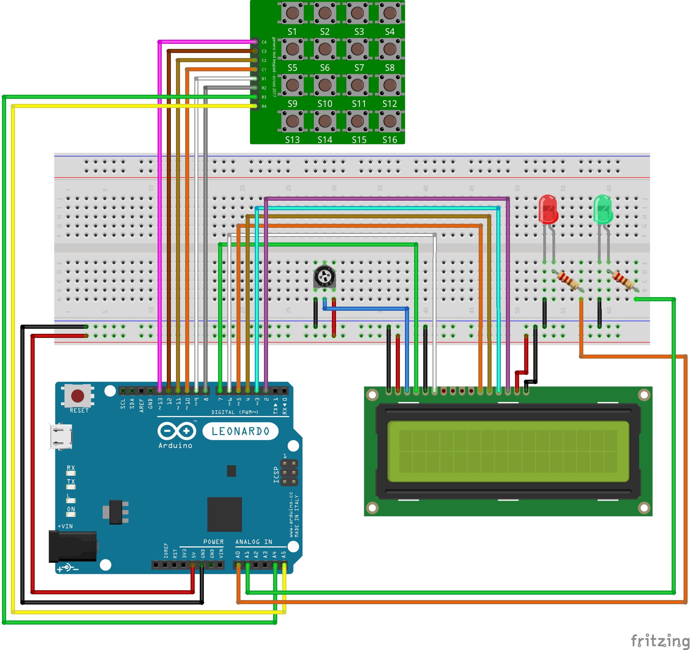

# 🔐 Keypad & LCD Lock System

This Arduino project simulates a **digital PIN code lock** using a **4×4 matrix keypad**, **16×2 LCD**, and **LED indicators**.  
It allows users to input a secure PIN and displays access status. After three incorrect attempts, the system locks itself.

---

## 🔧 Components Used

| Component               | Quantity |
|-------------------------|----------|
| Arduino Leonardo / Uno  | 1        |
| Breadboard              | 1        |
| 4×4 Keypad Module       | 1        |
| 16×2 LCD Display        | 1        |
| 10kΩ Potentiometer      | 1        |
| Red LED                 | 1        |
| Green LED               | 1        |
| 220Ω Resistors          | 2        |
| Jumper Wires            | 28       |

---

## 📷 Circuit Diagram

---

## 🧠 How It Works

- The **LCD** prompts the user to enter a 4-digit PIN.
- The **keypad** captures each digit and masks it on the display (`****`).
- Press `#` to submit the code, `*` to clear input.
- If the input matches the preset PIN:
  - ✅ Access granted (green LED on, LCD message)
- If incorrect:
  - ❌ Access denied (message shown), and tries incremented
- After 3 wrong attempts:
  - 🔒 The system locks (no more input accepted)
- You can customize the correct PIN in the code:  
  `const String kCorrectPin = "1234";`

---

## 💡 Highlights

- ✅ Matrix keypad scanning with `Adafruit_Keypad`  
- ✅ PIN masking on LCD with `*`  
- ✅ Lockout mechanism after multiple failed attempts  
- ✅ Visual feedback using LEDs  
- ✅ Modular code (`checkPin()`, `clearPinInput()`, `resetSystem()`)

---

## 🧪 Planned Improvements

- Add EEPROM saving of failed attempts  
- Add buzzer for audio feedback  
- Add timer-based unlock after cooldown period  
- Use a relay module to control real devices

---

> Made with 💡🔢🔐 using [Fritzing](https://fritzing.org/), [Arduino IDE](https://www.arduino.cc/en/software), and dedication.
