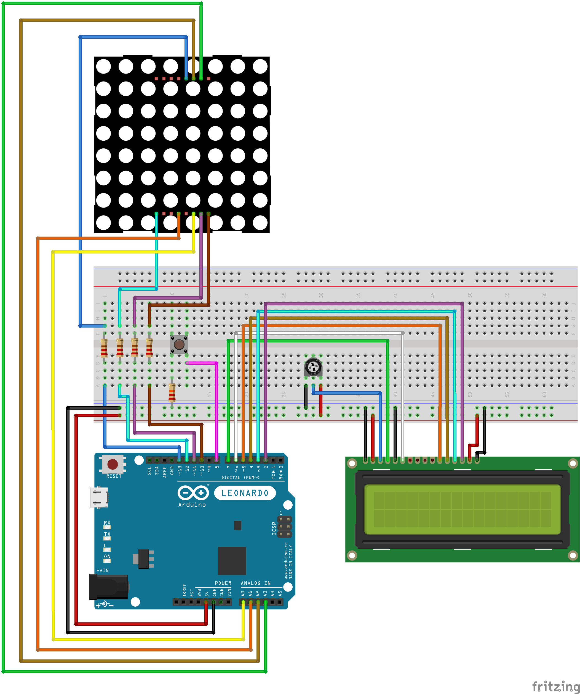

# 🎮 Reaction Game with LED Matrix & LCD

This Arduino project is a **reaction time game** that challenges the player to press a button as fast as possible after a visual signal.
It uses an **8×8 LED matrix** for the game signal and a **16×2 LCD** to display the measured reaction time.

---

## 🔧 Components Used

| Component               | Quantity |
| ------------------------| -------- |
| Arduino Leonardo / Uno  | 1        |
| Breadboard              | 1        |
| 8×8 LED Matrix (1088BS) | 1        |
| 16×2 LCD Display        | 1        |
| 10kΩ Potentiometer      | 1        |
| Push Button             | 1        |
| 10kΩ Resistor           | 1        |
| 220Ω Resistors          | 4        |
| Jumper Wires            | 29       |

---

## 📷 Circuit Diagram

---

## 🧠 How It Works

* The **LCD** shows instructions: "Get Ready...".
* After a random delay, the **LED matrix** lights up a symbol (⚡).
* The player must **press the button** as fast as possible.
* The **Arduino measures reaction time (ms)** and displays it on the LCD.
* If the button is pressed **too early**:
  * ❌ The attempt is invalid and shown on LCD.
* The game can be repeated infinitely.

---

## 💡 Highlights

* ✅ Randomized delay for unpredictability
* ✅ Fast reaction measurement with `millis()`
* ✅ LCD feedback with reaction time in ms
* ✅ Clear visual signal on LED matrix
* ✅ Simple and fun game for testing reflexes

---

## 🧪 Planned Improvements

* Add **score tracking** (best time, average)
* Add **sound feedback** using a buzzer
* Allow **two-player mode** with two buttons
* Save best score using **EEPROM**

---

> Made with ⚡🕹️⏱️ using [Arduino IDE](https://www.arduino.cc/en/software), [Fritzing](https://fritzing.org/), and creativity.